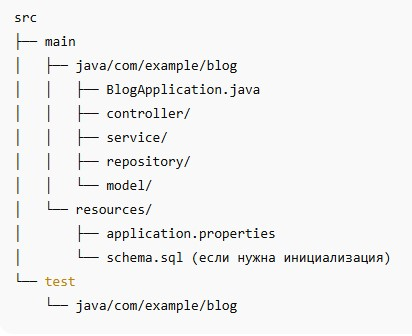
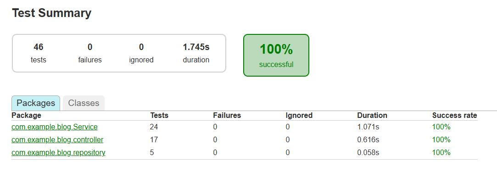

# Приложение-блог с использованием Spring Framework

## Требования и функциональность
* Веб-приложение, написанное на Spring Framework с использованием стартера (надстройки) - Spring Boot (версия 3.5.3 ); в качестве сервера приложений (embedded server) - используется встроенный по умолчанию Apache Tomcat. 
* Код приложения хранится в Git-репозитории (Github).
* Сборка приложения осуществляется с помощью Gradle (build system), которая управляет зависимостями и сборкой приложения.
* Код приложения написан на Java 21.
* База данных - PostgreSQL.
Блог состоит из двух веб-страниц (html + javascript): лента постов, страница поста.
* В ленте постов присутствуют: 
    - превью поста (название, картинка, коротко первый абзац не больше трёх строк);
    - количество комментариев к посту;
    - количество лайков к посту;
    - теги поста;
    - посты отображаются сверху вниз;
    - фильтрация по тегу;
    - пагинация (по 10, 20, 50 постов на странице).
* В ленте есть кнопка добавления поста, при нажатии на которую появляется форма добавления поста с возможностями:
    - добавления названия поста;
    - добавления картинки;
    - написания текста;
    - расстановки тегов.
* При нажатии на название поста (должно быть ссылкой) открывается страница поста, на которой присутствуют:
    - название поста;
    - картинка;
    - текст поста, разбитый на абзацы;
    - теги поста;
    - кнопка удаления и редактирования поста (функционал редактирования поста аналогичен его добавлению);
    - кнопка добавления комментария;
    - кнопка лайков поста, при нажатии на которую счётчик лайков увеличивается на единицу;
    - список комментариев (вложенность комментариев делать необязательно);
    - каждый комментарий содержит в себе текст комментария и возможность его редактирования/удаления.
* Добавление или редактирование комментария осуществляется на текущей странице. При нажатии на комментарий его текст заменяется на поле текстового ввода, при нажатии на Ctrl+Enter комментарий сохраняется.
* Приложение покрыто тестами (юнит- и интеграционными) с использованием JUnit 5, TestContext Framework и кэширования контекстов.

## Краткое описание работы приложения

Очистка сборки и запуск веб-приложения на встроенном сервере Jetty - 

    mvn clean jetty:run.

Приложение открывается по адресу: http://localhost:8080/posts

Приложение использует БД PostgreSQL.

Для работы необходимо создать БД (напр. myblog) и файл с настройками по адоесу: src/main/resources/application.properties:

    db.url=jdbc:postgresql://localhost:5432/myblog
    db.username=your_username
    db.password=your_password

    spring.jpa.hibernate.ddl-auto=update
    spring.jpa.show-sql=true
    spring.jpa.properties.hibernate.dialect=org.hibernate.dialect.PostgreSQLDialect

В функционал добавлена возможность загрузки изображений из проводника на странице http://localhost:9090/posts/add.

Для загрузки изображений необходимо создать папку по адресу: C:/myapp/uploads/, или любой другой путь прописать в файле: src/main/java/example/config/WebConfig.java/.

Загруженные изображения выводятся на странице ленты (/posts) в качестве обложки поста и на странице поста (/post/##)/

## Последовательность работы над приложением

1. Настройка проекта

Создание Maven-проекта: Примерная (начальная) структура каталогов:

 
Настройка pom.xml (Maven):

Указываем:

    *	Java 21
    *	Зависимости: Spring MVC, Spring Context, JPA, PostgreSQL, Jackson, JSTL, Servlet API

2. Конфигурация Spring

•	Java-класс AppConfig со всеми бинами (включая JPA, ViewResolver и т.д.) - Java-based configuration

•	Конфигурация AppInitializer.java (подключение DispatcherServlet)

3. Сущности и БД

•	Сущность Post с полями: id, title, content, imageUrl, tags, likesCount

•	Сущность Comment

•	Конфигурация persistence.xml (или через Java)

•	Скрипт создания схемы (schema.sql)

4. Контроллеры

•	PostController: отображение ленты, отдельного поста, добавление, редактирование, удаление

•	CommentController

5. Frontend

•	Используем HTML-шаблоны

•	Добавляем JS: открытие модалки, лайк, добавление комментариев, ajax-запросы, загрузка фото

6. Деплой

•	Настройка на запуск в Jetty (можно через mvn package → .war файл)

•	PostgreSQL: настройка и подключение к БД

## Тестирование

Интеграционные тесты проводятся в условиях, максимально приближенных к реальной среде выполнения приложения.

* используется реальная СУБД PostgreSQL

* задействована настоящая JPA-конфигурация (AppConfig, JpaConfig)

* выполняется чтение/запись в тестовую базу данных, а не в память

* контроллеры и сервисы подключаются к реальному слою данных через полноценный Spring-контекст.

Для работы тестов необходимо создать БД (напр. test) и файл с настройками по адоесу: src/test/resources/app.properties:

    db.url=jdbc:postgresql://localhost:5432/test
    db.username=your_username
    db.password=your_password

    spring.jpa.hibernate.ddl-auto=update
    spring.jpa.show-sql=true
    spring.jpa.properties.hibernate.dialect=org.hibernate.dialect.PostgreSQLDialect

Всего создано 17 тестов, протестированы следующие package:

* PostController - тип теста: Мок-тест контроллера (MockMvc + standaloneSetup). Тестируется:

возврат страницы /posts, содержимого модели, правильной view через MockMvc.

* PostService - тип теста: Юнит + Интеграционный. Тестируется:

получение, поиск, сохранение, удаление постов, фильтрация по тегам.

* CommentService -тип теста: Юнит + Интеграционный. Тестируется:

Получение, сохранение, удаление, редактирование комментариев.

* PostRepository - Интеграционный. Тестируется:

Сохранение, поиск по ID, поиск по тегам, поиск постов с комментариями.

* CommentRepository - Интеграционный. Тестируется:

Поиск комментариев по ID поста через findByPostId.

Запуск отдельного теста: mvn surefire:test -Dtest=PostControllerTest (на примере PostControllerTest).

Запуск всех тестов: mvn test.

Результат тестирования:

